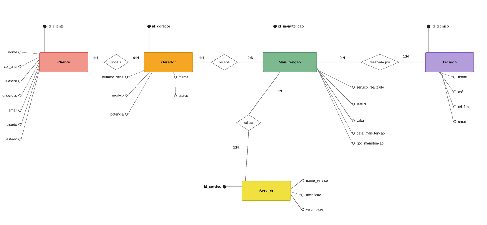

## 1. Caracterização da Organização

- S. A DE LIMA - Manutenção preventiva e corretiva de geradores.
- Telefone:+55 11 98373-9556
- E-mail: sandrolima@limasenergia.com.br
- Com fins lucrativos, a empresa conta com 15 funcionários e 96 clientes fixos, somando uma média de 33 manutenções em geradores de energia por mês. 

- Nos dias atuais, a empresa não tem um controle digital para a organização dos seus dados em geral: os dados são mantidos de maneira física, em fichas e papéis. Desde as informações dos atendimentos, até às informações dos clientes. 
Com um banco de dados adequado, essas informações ficarão muito mais seguras, além de estarem organizadas e reservadas somente num lugar, facilitando as buscas, consultas e alterações.

- A organização foi escolhida de acordo com as dificuldades relatadas. A partir disso foram encontradas possibilidades reais de implantar um plano de ação e renovação de fluxos de armazenamento de dados. Além de que o fácil acesso a empresa e contato com o dono contribuiram com a escolha do grupo.

- Endereço da empresa: https://maps.app.goo.gl/XExBHSXrFvbUNv8Y6?g_st=aw
---

## 2. Processos de Negócio
Cadastro de clientes:
- Objetivo: preservar as informações dos clientes da empresa e permitir cadastrar, consultar e buscar o histórico de cada um.
- Quando ocorre: no primeiro atendimento de um cliente novo.
- Dados registrados: nome (ou razão social), CPF/CNPJ, telefone, endereço, e-mail, cidade e estado.
- Regras: todos os campos são obrigatórios; o CPF/CNPJ não pode se repetir; CPF/CNPJ e endereço são armazenados de forma criptografada.
- Resultado: cliente disponível para vincular geradores e consultar o histórico.

Cadastro de geradores: 
- Objetivo: controlar os geradores supervisionados pela empresa, mantendo a assertividade nas manutenções.
- Quando ocorre: quando o cliente possui um gerador ainda não registrado.
- Dados registrados: número de série, marca, modelo, status (ativo, em manutenção ou inativo) e potência em kVA.
- Regras: todo gerador pertence a um cliente; o número de série é único (aceita letras e números); um cliente pode ter mais de um gerador, conforme o porte e a necessidade.
- Resultado: equipamento identificado e pronto para receber manutenções. Cada gerador tem um cronograma de inspeção preventiva, orientado pelos prazos de troca ou limpeza de peças como bateria, óleo, filtro de ar e tanque.

Manutenção:
- Objetivo: guardar as informações de cada atendimento, organizando todos os processos feitos em um cliente/gerador.
- Quando ocorre: a cada solicitação de atendimento, preventivo ou corretivo.
- Dados registrados: código da manutenção, data, tipo (preventiva ou corretiva), serviço realizado, status (aberta, em andamento ou concluída) e valor.
- Regras: o código é único e exclusivo, digitado somente com números; a manutenção é vinculada a exatamente um gerador; exige ao menos um técnico e ao menos um serviço, podendo ter vários de cada; o valor é a soma dos serviços e é armazenado de forma criptografada.
- Resultado: histórico completo do gerador e do cliente, que pode ser consultado a qualquer momento.

Serviço: 
- Objetivo: definir o tipo de serviço que será feito, incluindo os valores base.
- Dados registrados: nome, descrição e valor base.
- Regras: não há limite de serviços cadastrados por cliente; um serviço pode ser usado em várias manutenções; o valor base é armazenado de forma criptografada; os serviços seguem as normas NR-10, NR-12, NR-20 e NR-6.
- Resultado: catálogo que alimenta o cálculo do valor de cada manutenção.

Técnico:
- Objetivo: manter um banco de dados com as informações dos técnicos da empresa.
- Dados registrados: nome, CPF, telefone e e-mail.
- Regras: CPF único, digitado somente com números e com exatamente 11 dígitos; o CPF é armazenado de forma criptografada.
- Resultado: técnicos disponíveis para alocação nas manutenções.

---

## 3. Requisitos do Sistema

### 3.1 Requisitos Funcionais

- O sistema deve cadastrar dados incluindo as informações: nome, CPF/CNPJ, telefone, endereço,e-mail, cidade e estado. Gerador: número de série, marca, modelo, status e potência. Manutenções: data da manutenção, tipo de manutenção, serviço realizado, status e valor. Serviços: nome do serviço,descrição,e valor base. Técnicos: nome, cpf, telefone e email.

- O sistema deve permitir o registro de apenas um gerador por número de série, permitindo a inclusão letras e números.

- O sistema deve permitir cadastrar mais de um gerador por cliente, dependendo do porte e necessidade.

- O sistema deve permitir que exista apenas um técnico por CPF, sendo digitado apenas com números e tendo tamanho exato de 11 dígitos.

- O sistema deve permitir que haja o cadastro de mais de um serviço por cliente, de forma ilimitada

- O sistema deve cadastrar apenas quando todos os requisitos obrigatórios estiverem preenchidos (estes que foram citados no primeiro requisito funcional)

- O sistema deve permitir que uma manutenção tenha mais de um técnico vinculado, a manutenção precisa ser digitada somente em números, pois trata-se de código único e exclusivo.

- O sistema deve permitir que o usuário cadastre, consulte e busque os históricos dos clientes.

- O sistema deve dar a opção de guardar os RASCUNHOS dos cadastros incompletos, para que o usuario consiga retornar depois para finaliza-lo.

### 3.2 Requisitos Não Funcionais

- Criptografia: todos os dados sensíveis: CPF, endereço, valores; devem ser criptografados, visando a segurança e intgegridade dos usuários. Considerar a criptografia desses itens em todos os atributos que coincidirem com as nomenclaturas citadas.

- Acessibilidade: o sistema deve se adequar às normas impostas pela WCAG 2.1 nível AA, em todas as páginas.

- Tempo de resposta: O sistema deve cadastrar e carregar as respostas em até 5 segundos em todos os dispositivos de acesso.

- Portabilidade e Compatibilidade: O sistema deve estar compatível com os sistemas operacionais populares, desde sua instalação até as suas atualizações.

- Transparência: O programa deve se comportar de maneira acessível, simples e compreensível para todos os usuários.  

## 4. Regras de Negócio

Regras operacionais:
- Toda manutenção deve ter, no mínimo, um serviço vinculado no momento do seu registro; uma manutenção pode envolver mais de um serviço, e o valor final cobrado é a soma dos valores desses serviços.

- Toda manutenção deve ter, no mínimo, um técnico vinculado no momento do seu registro; uma manutenção pode envolver mais de um técnico.

- O gerador necessariamente tem que pertencer a um cliente.

- Dependendo do tipo de manutenção, muda a ordem do pagamento: no caso de uma manutenção corretiva, que impede o funcionamento do gerador, pode haver a troca antes de pagar, mas apenas se o orçamento for confirmado pelo cliente e ele estiver de acordo. Já no caso de uma manutenção preventiva, que não impede o funcionamento do gerador, a manutenção é realizada após o pagamento.

- Os geradores precisam ter um cronograma de inspeção de manutenção preventiva.

- Algumas informações não podem se repetir: são únicas para cada cliente, gerador ou técnico — respectivamente, o CPF/CNPJ, o número de série e o CPF.

Restrições organizacionais:
- Os serviços correspondem e respeitam as normas regulamentadoras NR-10 (elétrica), NR-12 (máquinas), NR-20 (inflamáveis e combustíveis) e NR-6 (EPI), justamente por envolver riscos elétricos, uso de máquinas e manuseio de combustível.

- O sistema não pode ter limite de horário para o registro, devido ao plantão de 24h de atendimento de emergência.

- Peças como bateria, óleo, filtro de ar e tanque têm prazo de troca ou limpeza, o que orienta o cronograma de inspeção preventiva.

---

## 5. Dicionário de Dados Conceitual (Preliminar)
Este modelo representa a empresa S. A DE LIMA, especializada em manutenção preventiva e corretiva de geradores de energia. O sistema tem como finalidade controlar os clientes, os geradores pertencentes a cada cliente, as manutenções realizadas nesses geradores, os técnicos responsáveis e os serviços prestados.

## 5.1 Modelo conceitual
| Entidade |  Relaciona-se com | Cardinalidade |
|----------|----------     |-----------------------|
| Cliente   | Gerador      | 	1:N — um cliente pode ter zero ou vários geradores (0,n); cada gerador pertence a exatamente um cliente.             
| Gerador   | Manutenção   |  1:N — um gerador pode ter zero ou várias manutenções; cada manutenção é feita em exatamente um gerador.             |
| Manutenção| Técnico      | 	N:N — uma manutenção precisa de pelo menos um técnico, e pode ter vários; um técnico pode participar de zero ou várias manutenções.             |
| Manutenção| Serviço      | 	N:N — uma manutenção usa pelo menos um serviço, e pode usar vários; um serviço pode ser usado em zero ou várias manutenções.              |

MANUTENCAO é a entidade que concentra os dois relacionamentos N:N do modelo com TECNICO e com SERVICO  por isso, na implementação física, é desdobrada em duas entidades associativas, MANUTENCAO_TECNICO e MANUTENCAO_SERVICO, que existem só para guardar essas ligações.

Cliente é a pessoa física ou jurídica que contrata os serviços e possui geradores cadastrados. Gerador é o equipamento de geração de energia pertencente a um cliente. Manutenção é o evento de atendimento (preventivo ou corretivo) realizado em um gerador. Técnico é o profissional responsável por executar as manutenções. Serviço é o catálogo de tipos de serviço que podem
ser prestados durante uma manutenção.

## 5.2 Fluxo de dados (visão de DFD)
Cliente é cadastrado no sistema → o cliente tem um ou mais geradores vinculados a ele em GERADOR → quando um gerador precisa de atendimento, abre-se um registro em MANUTENÇÃO, ligado a esse gerador → a manutenção é associada a um ou mais técnicos (via MANUTENCAO_TECNICO) e a um ou mais serviços do catálogo SERVIÇO (via MANUTENCAO_SERVICO) → o valor final da manutenção é calculado a partir dos serviços realizados e registrado em MANUTENÇÃO.

Tipos de dado:
|Tipo | Significado | Exemplo no documento |
|----------|-----------|-----------|
|ID_        |Identificador            | ID_CLIENTE, ID_GERADOR. |
|NM_        | Nome       | NM_CLIENTE, NM_MARCA.              |
|DS_        |  Descrição           | DS_ENDERECO, DS_EMAIL.                   |
|CD_        |    Código         | CD_ESTADO.                    |
|TP_        |   Tipo          | TP_STATUS, TP_MANUTENCAO.     |
|QT_        |   Quantidade          |  QT_POTENCIA, QT_VALOR.|
|INTEGER    |  Número inteiro, sem casas decimais   | Número inteiro, sem casas decimais.     |
|DECIMAL    | Número com casas decimais, usado para valores em dinheiro ou medidas   |  Decimal(10,2) guarda até 10 dígitos no total, sendo 2 deles depois da vírgula.    |
|CHAR       | Texto de tamanho fixo            |   Char(2) sempre guarda exatamente 2 caracteres, como a sigla de um estado ("SP"). |
|VARCHAR    |Texto de tamanho variável, até um limite máximo  |  Varchar(120) guarda até 120 caracteres usado em nomes, e-mails, telefones.|
|TEXT       |Texto livre e longo, sem um limite fixo de tamanho   | Usado em descrições mais extensas. |
|DATE       | Guarda uma data           |  Dia,mês e ano. |
|ENUM       | Só aceita um valor de uma lista fixa, definida de antemão| Enum(‘ativo’,‘em_manutencao’,‘inativo’) só permite essas três opções, nenhuma outra. |
|PK    |Chave primária | O campo que identifica aquele registro de forma única dentro da tabela não pode existir dois registros com o mesmo valor nesse campo.|
|FK    | Chave estrangeira  |  Um campo que “empresta” o ID de outra tabela, para ligar as duas. É assim que, um gerador fica sabendo a qual cliente ele pertence.|

## Notação formal (símbolos usados neste dicionário):
|Símbolo    |Significado  |
|----------|-----------|
| =         | é composto de.          |
| +         | e (conecta elementos obrigatórios).|
| @         | identificador (chave primária).           |
| ( )       |opcional.               |

## Dicionário de dados por entidade
## CLIENTE 
CLIENTE = @ID_CLIENTE + NM_CLIENTE + ID_CPF_CNPJ + DS_TELEFONE + DS_ENDERECO + DS_EMAIL + NM_CIDADE+ CD_ESTADO
Leitura: @ID_CLIENTE é o identificador único; os sete campos seguintes são obrigatórios e conectados por +, formando o cadastro completo exigido no primeiro atendimento do cliente.

| Atributo | Tipo físico | Obrigatório |Significado e relevância|
|----------|-----------|------------------------------|-----------|
|ID_CLIENTE   |  integer          |  Sim (PK)           | Identificador único do cliente no sistema; gerado automaticamente. |
|NM_CLIENTE  | varchar(120)          |  Sim            |Nome completo (pessoa física) ou razão social (pessoa jurídica) do cliente. Ex.: “Comércio Fictício LTDA”. |
|ID_CPF_CNPJ  |  varchar(18)         |  Sim (único)  |Documento de identificação do cliente (CPF ou CNPJ); dado sensível — armazenado de forma criptografada. |
|DS_TELEFONE |  varchar(20)         |   Sim           |Telefone de contato do cliente. |
|DS_ENDERECO  | varchar(200)          |  Sim            | Endereço completo do cliente (rua, número, bairro); dado sensível — armazenado de forma criptografada. |
| DS_EMAIL  | varchar(120)          |   Sim           |  E-mail de contato do cliente.|
| NM_CIDADE | varchar(80)          |   Sim           |  Cidade onde o cliente está localizado.|
| CD_ESTADO |char(2)            |   Sim           | Sigla do estado (ex.: SP); domínio fixo das 27 UFs brasileiras.|

## GERADOR
GERADOR = @ID_GERADOR + ID_CLIENTE + ID_NUMERO_SERIE + NM_MARCA + NM_MODELO + TP_STATUS +QT_POTENCIA
Leitura: @ID_GERADOR é o identificador único; ID_CLIENTE é a chave estrangeira que implementa, na tabela física, o relacionamento 1:N descrito é o que garante a regra de que todo gerador deve estar vinculado a um cliente. Os demais campos são obrigatórios e conectados por +.

| Atributo | Tipo físico | Obrigatório |Significado e relevância|
|----------|-----------|------------------------------|-----------|
ID_GERADOR |  integer |  Sim (PK) |  Identificador único do gerador no sistema; gerado automaticamente. | 
ID_CLIENTE |  integer  | Sim (FK) |  Referência ao cliente proprietário do gerador. | 
ID_NUMERO_SERIE |  varchar(30) |  Sim (único) |  Número de série de fabricação do gerador; aceita letras e números, não pode se repetir. | 
NM_MARCA |  varchar(60) |  Sim |  Fabricante do gerador. Ex.: “Cummins”. | 
NM_MODELO  | varchar(60) |  Sim |  Modelo do gerador dentro da marca. | 
TP_STATUS  | enum(‘ativo’,‘em_manutencao’,‘inativo’) |  Sim  | Situação atual do gerador. | 
QT_POTENCIA  | decimal(10,2) |  Sim  | Potência do gerador em kVA; valor numérico positivo. | 

## MANUTENÇÃO
MANUTENCAO = @ID_MANUTENCAO + ID_GERADOR + DT_MANUTENCAO + TP_MANUTENCAO +
DS_SERVICO_REALIZADO + TP_STATUS + QT_VALOR
Leitura: @ID_MANUTENCAO é o identificador único, digitado somente com números; ID_GERADOR é a chave estrangeira que liga a manutenção ao gerador atendido, garantindo que toda manutenção esteja vinculada a exatamente um gerador. Os demais campos são obrigatórios e conectados por +.

| Atributo | Tipo físico | Obrigatório |Significado e relevância|
|----------|-----------|------------------------------|-----------|
ID_MANUTENCAO|integer| Sim (PK)|Identificador único e exclusivo da manutenção; gerado automaticamente.|
ID_GERADOR| integer| Sim (FK) | Referência ao gerador atendido nesta manutenção.|
DT_MANUTENCAO| date| Sim| Data em que a manutenção foi executada.|
TP_MANUTENCAO| enum(‘preventiva’,‘corretiva’)| Sim |Classifica a manutenção quanto ao motivo do atendimento.|
DS_SERVICO_REALIZADO| text |Sim |Descrição do que foi feito no atendimento.|
TP_STATUS| enum(‘aberta’,‘em_andamento’,‘concluida’)| Sim |Situação atual da manutenção.|
QT_VALOR |decimal(10,2)| Sim |Valor total cobrado, soma dos serviços vinculados via MANUTENCAO_SERVICO; dado sensível armazenado de forma criptografada. |

## TÉCNICO
TECNICO = @ID_TECNICO + NM_TECNICO + ID_CPF + DS_TELEFONE + DS_EMAIL
Leitura: @ID_TECNICO é o identificador único; os demais campos são obrigatórios e conectados por +.

| Atributo | Tipo físico | Obrigatório |Significado e relevância|
|----------|-----------|------------------------------|-----------|
ID_TECNICO| integer| Sim (PK)| Identificador único do técnico; gerado automaticamente.|
NM_TECNICO| varchar(120)| Sim| Nome completo do técnico.|
ID_CPF |char(11)| Sim (único) |CPF do técnico, digitado somente com números, exatamente 11 dígitos; dado sensível  armazenado de forma criptografada.|
DS_TELEFONE| varchar(20)| Sim | Telefone de contato do técnico.|
DS_EMAIL| varchar(120)|Sim| E-mail de contato do técnico.|

## SERVIÇO
SERVICO = @ID_SERVICO + NM_SERVICO + DS_DESCRICAO + QT_VALOR_BASE
Leitura: @ID_SERVICO é o identificador único; os demais campos são obrigatórios e conectados por +.

| Atributo | Tipo físico | Obrigatório |Significado e relevância|
|----------|-----------|------------------------------|-----------|
ID_SERVICO|integer|Sim (PK)| Identificador único do serviço no catálogo; gerado automaticamente.|
NM_SERVICO| varchar(120) |Sim| Nome do serviço oferecido. Ex.: “Troca de óleo”.|
DS_DESCRICAO| text| Sim |Explicação detalhada do que o serviço inclui.|
QT_VALOR_BASE| decimal(10,2)| Sim |Valor de referência do serviço, antes de ajustes por manutenção; dado sensível — armazenado de forma criptografada.|
          
## MANUTENÇÃO_TÉCNICO
MANUTENCAO_TECNICO = @ID_MANUTENCAO + @ID_TECNICO
| Atributo | Tipo físico | Obrigatório |Significado e relevância|
|----------|-----------|------------------------------|-----------|
ID_MANUTENCAO| integer| Sim (FK, compõe PK)| Referência à manutenção envolvida.|
ID_TECNICO |integer |Sim (FK, compõe PK) |Referência ao técnico envolvido; permite mais de um técnico por manutenção.|

## MANUTENÇÃO_SERVIÇO
MANUTENCAO_SERVICO = @ID_MANUTENCAO + @ID_SERVICO
| Atributo | Tipo físico | Obrigatório |Significado e relevância|
|----------|-----------|------------------------------|-----------|
ID_MANUTENCAO | integer| Sim (FK, compõe PK) |Referência à manutenção envolvida.|
ID_SERVICO| integer| Sim (FK, compõe PK) |Referência ao serviço envolvido; permite mais de um serviço por manutenção.|

## 6. Modelagem Conceitual (Entidades, Atributos, Relacionamentos)
A modelagem conceitual foi elaborada a partir dos processos de negócio, requisitos funcionais e regras de negócios levantados para a empresa. O modelo busca representar as principais informações relacionadas aos clientes, seu geradores, manutenções realizadas, os técnicos envolvidos e os serviços prestados.

### 6.1 Entidades reconhecidas

Foram identificadas cinco entidades principais.

### Cliente

Representa as pessoas físicas ou jurídicas que contratam os serviços da empresa. A entidade armazena  informações necessárias para a identificação e contato com o cliente.

### Gerador

Representa os equipamentos de geração de energia pertencentes aos clientes. A entidade permite controlar informações como número de série, marca, modelo, status e potência.

### Manutenção

Representa o atendimento realizado pela empresa em um determinado gerador. Cada registro de manutenção permite armazenar informações sobre a data, tipo de manutenção, status e valor do atendimento.

### Técnico

Representa os profissionais responsáveis pela execução das manutenções. São armazenadas informações para identificação e contato dos técnicos.

### Serviço

Representa os serviços oferecidos pela empresa e que podem ser utilizados durante uma manutenção, contendo informações como nome, descrição e valor-base.

### 6.2 Atributos e classificações

Os atributos foram definidos de acordo com as informações necessárias para identificar e controlar cada entidade.

Cliente

| Atributo     | Classificação         |
| ------------ | --------------------- |
| `id_cliente` | Identificador         |
| `nome`       | Descritivo            |
| `cpf_cnpj`   | Identificação / único |
| `telefone`   | Contato               |
| `endereco`   | Localização           |
| `email`      | Contato               |
| `cidade`     | Localização           |
| `estado`     | Localização           |

O id_cliente identifica exclusivamente cada cliente. O cpf_cnpj deve ser único e obrigatório. Essas informações já estão definidas no dicionário de dados do projeto.

Gerador

| Atributo       | Classificação         |
| -------------- | --------------------- |
| `id_gerador`   | Identificador         |
| `id_cliente`   | Referência            |
| `numero_serie` | Identificação / único |
| `marca`        | Descritivo            |
| `modelo`       | Descritivo            |
| `status`       | Classificação         |
| `potencia`     | Quantitativo          |

O numero_serie é um identificador único do equipamento, enquanto id_cliente representa sua ligação com o proprietário.

Manutenção

| Atributo            | Classificação |
| ------------------- | ------------- |
| `id_manutencao`     | Identificador |
| `id_gerador`        | Referência    |
| `data_manutencao`   | Temporal      |
| `tipo_manutencao`   | Classificação |
| `servico_realizado` | Descritivo    |
| `status`            | Classificação |
| `valor`             | Quantitativo  |

A entidade registra o atendimento realizado em um gerador e permite diferenciar manutenções preventivas e corretivas.

Técnico

| Atributo     | Classificação         |
| ------------ | --------------------- |
| `id_tecnico` | Identificador         |
| `nome`       | Descritivo            |
| `cpf`        | Identificação / único |
| `telefone`   | Contato               |
| `email`      | Contato               |

O cpf é único para cada técnico, conforme a regra estabelecida para o sistema.

Serviço

| Atributo       | Classificação |
| -------------- | ------------- |
| `id_servico`   | Identificador |
| `nome_servico` | Descritivo    |
| `descricao`    | Descritivo    |
| `valor_base`   | Quantitativo  |

Os atributos permitem identificar o serviço, explicar o que será realizado e estabelecer seu valor de referência.

### 6.3 Relacionamentos pertinentes

Foram identificados quatro relacionamentos principais entre as entidades.

# Cliente — possui — Gerador

Cardinalidade: 1:N

Um cliente pode possuir zero ou vários geradores, enquanto cada gerador pertence obrigatoriamente a um único cliente.

CLIENTE (0,n) ─── possui ─── (1,1) GERADOR

Essa relação representa a regra de negócio de que todo gerador cadastrado deve estar vinculado a um cliente.

# Gerador — recebe — Manutenção

Cardinalidade: 1:N

Um gerador pode receber zero ou várias manutenções durante sua utilização. Cada manutenção, entretanto, deve estar obrigatoriamente relacionada a um único gerador.

GERADOR (0,n) ─── recebe ─── (1,1) MANUTENÇÃO

Essa relação permite manter o histórico de atendimentos realizados em cada equipamento.

# Manutenção — realizada por — Técnico

Cardinalidade: N:N

Uma manutenção pode envolver um ou vários técnicos, enquanto um técnico pode participar de zero ou várias manutenções.

MANUTENÇÃO (1,n) ─── realizada por ─── (0,n) TÉCNICO

A cardinalidade foi definida dessa forma porque o sistema deve permitir que uma mesma manutenção tenha mais de um técnico vinculado.

# Manutenção — utiliza — Serviço

Cardinalidade: N:N

Uma manutenção pode utilizar um ou vários serviços, enquanto um serviço pode ser utilizado em zero ou várias manutenções.

MANUTENÇÃO (1,n) ─── utiliza ─── (0,n) SERVIÇO

Essa relação foi definida porque uma manutenção pode envolver mais de um serviço e o valor final pode ser composto pelos serviços realizados.

### 6.4 Restrições e políticas organizacionais

O modelo conceitual considera as principais regras de negócio identificadas durante o levantamento da empresa.

Todo gerador deve estar vinculado a um cliente.
Toda manutenção deve estar vinculada a um gerador.
O número de série do gerador deve ser único.
O CPF do técnico deve ser único.
Uma manutenção deve possuir pelo menos um técnico.
Uma manutenção deve possuir pelo menos um serviço.
Uma manutenção pode possuir vários técnicos.
Uma manutenção pode possuir vários serviços.
O sistema deve manter o histórico das manutenções realizadas nos geradores.
O tipo de manutenção pode ser preventiva ou corretiva.
Os geradores devem possuir um cronograma de inspeção preventiva.
O atendimento não deve possuir limitação de horário devido ao plantão de 24 horas da empresa.

---

## 7. Diagrama Entidade-Relacionamento (DER)

---

## 8. Justificativa Técnica
- Entidades: Separamos Cliente, Gerador, Manutenção, Técnico e Serviço porque cada uma tem ciclo de vida próprio — um cliente existe sem gerador, um gerador passa por várias manutenções, um técnico atende várias manutenções, e um serviço é um catálogo reutilizável. Se juntasse manutenção e gerador ficaria duplicando dados a cada manutenção assim também como serviço é uma entidade separada para evitar repetição de dados.

- Atributos: Cada atributo ficou na entidade que ele realmente descreve. Dados que variam a cada evento (data, tipo, status, valor) foram para Manutenção; dados fixos do equipamento (marca, modelo, potência) ficaram em Gerador. Os dados do técnico que não entraram direto em manutenção pra evitar que aja redundância e também possibilitar consulta de histórico de cada técnico.

Cardinalidade:
- Cliente–Gerador (0,n)-(1,1): um cliente pode ter vários geradores, mas cada gerador tem só um dono.
  
- Gerador-Manutenção (0,n)-(1,1): um gerador pode ter várias manutenções, mas cada manutenção é sobre um único gerador.
  
- Manutenção–Técnico (1,n)-(0,n): toda manutenção precisa de pelo menos um técnico, e um técnico pode atender várias manutenções.
  
- Manutenção–Serviço (1,n)-(0,n): toda manutenção precisa de ao menos um serviço definido no momento do registro; um serviço pode estar cadastrado no catálogo sem nunca ter sido utilizado, ou ter sido aplicado em várias manutenções.
  
---

## 9. Uso de Inteligência Artificial
| Item | Registro |
|------|------------------|
| Ferramenta e etapa 1 | Gemini Flash, usada durante a etapa de levantamento dos Requisitos Não Funcionais (RNF) do sistema de controle de geradores e manutenções.|
| *Motivação* | Precisávamos de ajuda para acrescentar mais alguns Requisitos Não Funcionais para compor o dicionário de dados e utilizamos a IA como um ponto de partida. O objetivo foi identificar quais categorias de RNF são mais comuns, como desempenho, segurança e disponibilidade, além de obter exemplos de como esses requisitos poderiam ser descritos. |
| *Prompt(s) utilizados* | "Cite alguns Requisitos Não Funcionais"|
| *Resposta recebida* | A IA explicou que os Requisitos Não Funcionais estão relacionados à forma como o sistema deve funcionar, estabelecendo características, restrições e critérios de qualidade, em vez de descrever funcionalidades específicas. Em seguida, apresentou algumas categorias e exemplos. Entre elas, foram citadas Desempenho e Eficiência, com exemplos relacionados ao tempo de resposta e à capacidade de processamento do sistema, e Segurança, com exemplos como a criptografia de dados sensíveis e a utilização de autenticação de dois fatores (2FA). A resposta também mencionava uma terceira categoria, relacionada à disponibilidade, mas essa parte não chegou a ser analisada completamente	 |
| *Fontes consultadas e verificadas* | Não foram utilizadas fontes externas. As informações vieram do próprio material produzido pelo grupo, com base na visita e na pesquisa de campo realizadas na empresa. |
| *Trechos rejeitados ou corrigidos* | Os exemplos numéricos relacionados ao desempenho, como o tempo de resposta de até 2 segundos e o processamento de 1.000 transações por segundo, foram ajustados. Esses valores eram genéricos e não representavam a realidade da empresa estudada, que possui 96 clientes fixos e uma média de 33 manutenções por mês.	 |
| *Justificativa da escolha final* |Decidimos aproveitar as categorias sugeridas pela IA, principalmente desempenho/eficiência e segurança, pois elas são importantes para o sistema que está sendo desenvolvido. Porém, os exemplos foram adaptados de acordo com a realidade da empresa. Também foram incluídos requisitos relacionados à segurança dos dados e à autenticação. |
| *Reflexão crítica* | O uso da IA ajudou a ter uma ideia inicial de quais Requisitos Não Funcionais poderiam ser utilizados no sistema. Porém, percebemos que nem todos os exemplos apresentados serviam para a realidade da empresa, principalmente os valores relacionados ao desempenho. Por isso, foi necessário analisar as sugestões e fazer as adaptações. Com isso, entendemos que a IA é uma boa ferramenta para ajudar no desenvolvimento do trabalho, mas não devemos aceitar tudo o que ela apresenta sem verificar. É importante usar nosso próprio conhecimento e considerar as necessidades reais da empresa.	|

| Item | Registro |
|------|------------------|
| Ferramenta e etapa 2 |Claude, utilizada como apoio para organizar o dicionário de dados (DER) de acordo com o modelo apresentado. |
| *Motivação* | Organizar as informações do rascunho no formato do exemplo solicitado. |
| *Prompt(s) utilizados* | "Poderia me ajudar a revisar o arquivo".|
| *Resposta recebida* | 	Documento reorganizado com tabelas de atributos, descrição, e regra de negócio associada. |
| *Fontes consultadas e verificadas* | Não foram utilizadas fontes externas. As informações vieram do próprio material produzido pelo grupo, com base na visita e na pesquisa de campo realizadas na empresa.|
| *Trechos rejeitados ou corrigidos* | Decidimos retirar as partes de “Log de acesso” e “Conformidade com a LGPD” que apareciam no exemplo. Essas seções estavam mais relacionadas ao caso apresentado no modelo, que envolvia dados sensíveis de saúde, e não eram necessárias para o projeto da empresa escolhida. |
| *Justificativa da escolha final* | A estrutura do exemplo foi aproveitada porque atendia ao formato solicitado, mas algumas partes foram retiradas para que o documento ficasse adequado ao contexto da empresa e às informações levantadas. |
| *Reflexão crítica* | 	O exemplo ajudou bastante na organização das informações, mas foi necessário analisar o que realmente se aplicava ao projeto. Dessa forma, utilizamos apenas o modelo como referência e fizemos as adaptações necessárias ao próprio trabalho. |

| Item | Registro |
|------|------------------|
| Ferramenta e etapa 3 | Claude, utilizada durante a elaboração da etapa das regras de negócio, para a realização de correções gramaticais do conteúdo.  |
| *Motivação* | Correção do texto contido na etapa 4 (Regras de negócio). |
| *Prompt(s) utilizados* |  [Problema]: O texto pode conter erros. [Condição]: Pode ter qualquer estilo. [Desafio]: Corrigir sem alterar o sentido. [Tarefa]: Corrija gramática, ortografia, pontuação e acentuação, mantendo o estilo original. Retorne apenas o texto corrigido. |
| *Resposta recebida* | Texto corrigido e mantendo concordância e as regras gramáticais. |
| *Fontes consultadas e verificadas* | Não foram utilizadas fontes externas. As informações vieram do próprio material produzido pelo grupo, com base na visita e na pesquisa de campo realizadas na empresa. |
| *Trechos rejeitados ou corrigidos* | Foi decidido inserir a parte "justamente por envolver riscos elétricos, uso de máquinas e manuseio de combustível.", justamente pra existir uma justificativa dessa restrições organizacionais |
| *Justificativa da escolha final* | A IA analisa os detalhes do texto para realizar as correções necessárias |
| *Reflexão crítica* | A correção foi prática e eficaz, porém foi necessário conferir as informações e analisar se era necessário realizar alguma alteração ou adicionar alguma informação. |

| Item | Registro |
|------|------------------|
| Ferramenta e etapa 4 | ChatGPT, utilizado como apoio durante a etapa de Modelagem Conceitual do sistema de controle de geradores e manutenções.|
| *Motivação* |  Tivemos dificuldade para organizar as entidades, seus atributos e principalmente as cardinalidades dos relacionamentos entre Cliente, Gerador, Manutenção, Técnico e Serviço. Utilizamos a IA como apoio para revisar a estrutura que já havia sido definida pelo grupo e verificar se os relacionamentos estavam de acordo com os requisitos e regras de negócio levantados. |
| *Prompt(s) utilizados* | “Com base nos requisitos, regras de negócio e dicionário de dados do projeto, ajude a identificar as entidades, atributos, relacionamentos e cardinalidades da modelagem conceitual.” |
| *Resposta recebida* | A IA organizou as principais entidades do sistema e explicou os relacionamentos entre elas. Foi indicado que Cliente e Gerador possuem uma relação 1:N, Gerador e Manutenção possuem uma relação 1:N, enquanto Manutenção e Técnico e Manutenção e Serviço possuem relações N:N. Também foram apresentadas justificativas para as cardinalidades com base nas regras de negócio.	 |
| *Fontes consultadas e verificadas* |Não foram utilizadas fontes externas. As informações vieram do próprio material produzido pelo grupo, com base na visita e na pesquisa de campo realizadas na empresa.|
| *Trechos rejeitados ou corrigidos* | 	Algumas sugestões da IA foram analisadas e não foram utilizadas diretamente, principalmente sugestões relacionadas à criação de entidades associativas. Como o objetivo dessa etapa era representar o modelo conceitual, mantivemos os relacionamentos N:N entre Manutenção e Técnico e entre Manutenção e Serviço conforme a estrutura adotada pelo grupo. |
| *Justificativa da escolha final* | A IA foi utilizada apenas como apoio para revisar e organizar o modelo. A decisão final sobre as entidades, atributos e cardinalidades foi feita pelo grupo, considerando os requisitos e as regras de negócio da empresa estudada. |
| *Reflexão crítica* | A utilização da IA ajudou principalmente a visualizar possíveis problemas na modelagem e entender melhor as cardinalidades. Porém, percebemos que uma sugestão gerada automaticamente não deve ser aplicada sem análise. Foi necessário comparar as sugestões com as regras de negócio e com o modelo que já havia sido desenvolvido pelo grupo. Dessa forma, a IA serviu como ferramenta de apoio e revisão, e não como responsável pela definição final do modelo.	|
